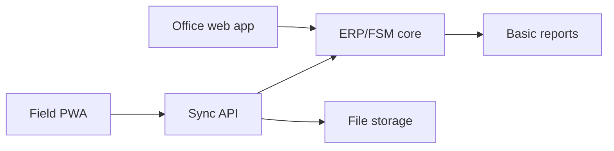

# Component Map

## Purpose

This page maps proposed product capabilities to the component that should own them. It is a guardrail against building every feature directly into the field PWA or overloading the ERP with offline behavior it is not designed to handle.

This map describes ownership of records and capabilities. It does not imply the user should see each upstream component's native interface. The preferred final shape is a unified ProJob suite UI over these capabilities; see [Suite Composition and Design](suite-composition-and-design.md).

## Component Responsibilities

| Capability | Primary owner | Supporting component | Notes |
| --- | --- | --- | --- |
| Customer records | ERP/FSM core | Application API | Commercial source of truth |
| Sites/locations | ERP/FSM core | Field PWA read model | Field users need cached site summaries |
| Quotes/proposals | ERP/FSM core | Office web app | Field app may raise variation requests, not final commercial documents |
| Jobs/work orders | ERP/FSM core | Field PWA, Sync API | ERP owns authoritative job; PWA owns local execution state while offline |
| Checklist templates | ERP/FSM or app admin | Field PWA cache | Templates should be versioned |
| Checklist responses | Field PWA then Sync API | ERP/FSM evidence record | Preserve history and conflicts |
| Photos/signatures | Field PWA capture | Attachment service, ERP links | Append-only with checksums |
| Time entries | Field PWA then Sync API | ERP/FSM timesheets | Corrections should be audited |
| Material usage | Field PWA then Sync API | ERP/FSM stock moves | Avoid direct offline stock mutation |
| Vehicle/tool stock | ERP/FSM core | Field PWA cache | Device may hold a scoped stock view |
| Scheduling | ERP/FSM or scheduler service | Office web app | Depends on ERP selected |
| Cross-project dependencies | Planning layer | Office web app, ERP links | OpenProject-style ownership if needed |
| Subcontractor visibility | Permission service / ERP portal | Field PWA | Must be scoped by company/project/job |
| Reports/dashboards | Reporting projections | ERP/FSM, planning layer | Avoid heavy reporting queries against mobile sync API |
| Documents/drawings | Document store | Field PWA cache, ERP links | Needs versioning and expiry |
| Notifications | Application API | Email/SMS/push provider | Should reference canonical records |
| Audit trail | Sync API + ERP/FSM | Reporting | Every offline mutation needs traceability |

## Capability Boundaries

### Field PWA Should Own

- Local job execution UX.
- Offline queue and local read model.
- Checklist and evidence capture.
- Visible sync states.
- Safe retry behavior.

### Field PWA Should Not Own

- Final invoice state.
- Customer master records.
- Global stock truth.
- Cross-company commercial access rules.
- Long-term reporting data model.

### ERP/FSM Core Should Own

- Commercial records.
- Authoritative jobs/work orders.
- Stock, timesheets, and invoice-ready records.
- Audited approvals.

### Sync API Should Own

- Idempotency.
- Conflict detection.
- Field mutation validation.
- Attachment metadata processing.
- ERP adapter calls.

## MVP Component Set

The smallest credible MVP component set is:

Do not add OpenProject, separate BI, route optimization, or complex subcontractor portals until the core offline job workflow is proven.

## Suite Presentation Rule

| Component | User-facing presentation |
| --- | --- |
| ERP/FSM core | Mostly hidden behind ProJob office/admin workflows; native admin UI acceptable for specialist configuration |
| Field PWA | Fully ProJob-native UI |
| Sync API | Not directly visible except through sync state, queue, and conflict review UI |
| Planning layer | Prefer ProJob project/dependency views; native OpenProject UI acceptable for programme admins |
| Forms/checklist engine | ProJob-native checklist UI for field users; upstream form builder can be admin-only if used |
| CMMS/asset system | ProJob resource/asset summaries for everyday users; native CMMS UI only for asset administrators |
| File storage | ProJob evidence/document UI; raw storage UI hidden |

## Component Selection Rule

When deciding where a new feature belongs:

1. If it must work offline during site work, it belongs in the Field PWA and Sync API.
2. If it affects money, stock, or legal/audit state, ERP/FSM must own the authoritative record.
3. If it is about programme dependencies across jobs/projects, the planning layer owns it.
4. If it is a derived view, reporting owns it.
5. If it is a file or photo, object/document storage owns the bytes and ERP owns the business link.
