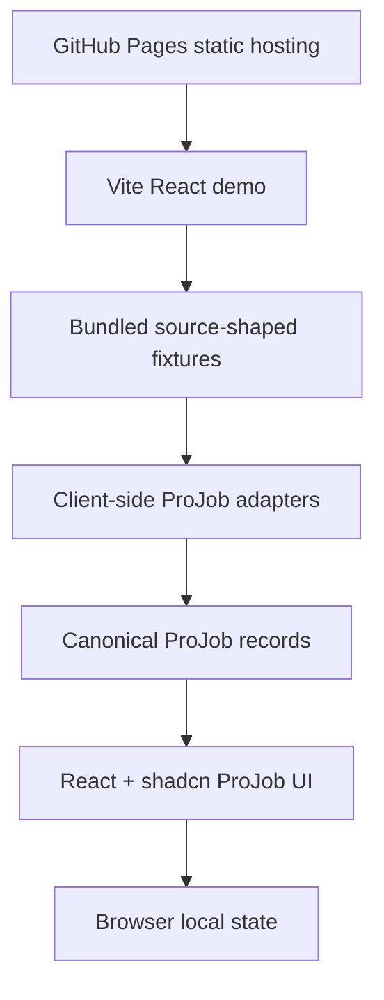
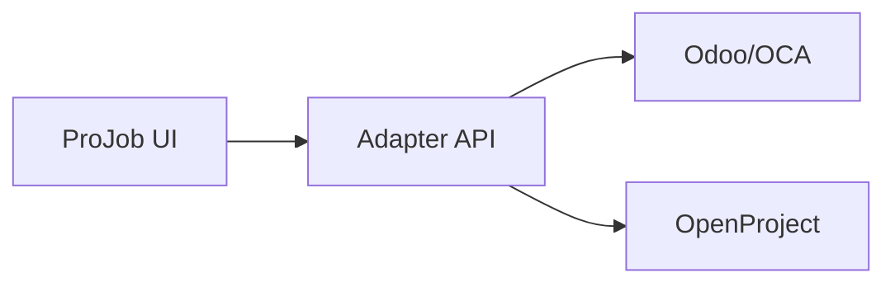

# Demo Architecture

Date: 2026-04-26

## Purpose

This page records how the public ProJob UI demo should work inside the current static [GitHub Pages](../demo.md) site.

The goal is to prove the ProJob product surface can present records from Odoo-style ERP/FSM data and OpenProject-style planning data through one coherent UI. The goal is not to pretend GitHub Pages is a live backend runtime.

## Static Pages Boundary

GitHub Pages can host:

- MkDocs wiki pages.
- The compiled Vite/React demo app.
- Static fixture data.
- Client-side adapter and normalisation code.
- Browser-local state such as `localStorage` or IndexedDB.

GitHub Pages cannot host:

- Odoo.
- ERPNext.
- OpenProject.
- Server-side API adapters.
- Authentication brokers.
- Multi-user sync services.
- Background workers outside the browser.

## Published Shape

The site is published as one Pages artifact:

```text
site/
  index.html
  architecture/
  poc/
  demo/
    projob-ui/
      index.html
      assets/
```

The wiki remains the primary documentation surface. The demo is a static sub-app at:

```text
https://ajdench.github.io/ProJob-Wiki/demo/projob-ui/
```

## Demo Data Strategy

The public demo uses source-shaped fixtures through the [Adapter Contract](adapter-contract.md):

| Source-shaped fixture | Represents | ProJob adapter output |
| --- | --- | --- |
| Odoo-shaped work order | ERP/FSM record for field execution | Job, site, material, evidence, review state |
| Odoo-shaped material/time state | ERP commercial/stock/time ownership | Material exception, time entry, invoice-ready review |
| OpenProject-shaped work package | Planning record | Job-like dependency task |
| OpenProject-shaped milestone | Programme record | Project milestone and blocker |
| OpenProject-shaped dependency | Planning relationship | Blocker/dependency state in ProJob |

The demo should show source badges such as `Odoo work order fixture` and `OpenProject dependency fixture` while keeping the primary UI language ProJob-native.

## Runtime Layers



## JS Tools That Can Be Bundled

| Tool | Static bundle fit | Use in demo |
| --- | --- | --- |
| Dexie | Good | Candidate next step for IndexedDB persistence |
| PouchDB | Possible but larger | Use only when testing CouchDB-style replication |
| RxDB | Possible but heavier | Use when testing reactive offline database behaviour |
| PGlite | Possible but heavier WASM | Defer unless SQL/Postgres-in-browser is specifically needed |
| DuckDB-WASM | Possible but analytics-oriented | Defer; better for reporting/analysis than job mutation state |
| TanStack DB | Possible | Candidate client-store layer, not a complete backend by itself |

For the first public demo, use fixtures and lightweight browser state. Avoid heavy WASM unless a specific scenario requires it.

## Live Backend Path

A separate local or hosted backend demo is still needed to prove live API behaviour:



That live path should reuse the same canonical ProJob records and UI states proven in the static demo.

## Current Implementation

The current demo implementation lives in:

[`experiments/projob-ui-spike`](https://github.com/ajdench/ProJob-Wiki/tree/main/experiments/projob-ui-spike)

It now includes:

- Odoo-shaped fixture mode.
- OpenProject-shaped fixture mode.
- Combined fixture mode.
- ProJob adapter modules for canonical records and source selection.
- Local live Odoo adapter stub for future API testing.
- Static browser persistence through `localStorage`.
- Offline/sync/review state simulation.
- GitHub Pages publishing under `/demo/projob-ui/`.
