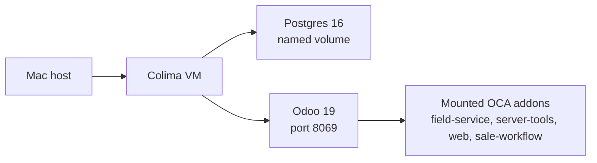
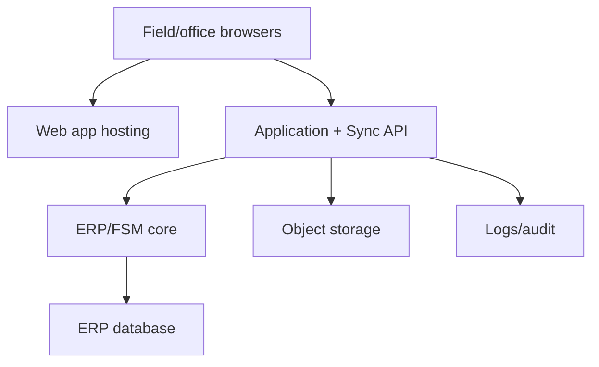

# Deployment Runtime

## Purpose

This page explains how the current wiki, POC environments, and future production product would be deployed.

## Current Wiki Runtime

| Runtime | Current state |
| --- | --- |
| Source repository | [`ajdench/ProJob-Wiki`](https://github.com/ajdench/ProJob-Wiki) |
| Public site | [GitHub Pages](https://ajdench.github.io/ProJob-Wiki/) |
| Build | GitHub Actions runs `mkdocs build --strict` |
| Local build | `.venv/bin/mkdocs build --strict` |
| Local preview | `.venv/bin/mkdocs serve` |
| LLM discovery | [`/llms.txt`](https://ajdench.github.io/ProJob-Wiki/llms.txt) and [`/llms-full.txt`](https://ajdench.github.io/ProJob-Wiki/llms-full.txt) |

The wiki is static. There is no server-side app runtime for the published documentation site.

## Local Container Runtime

| Tool | Status | Role |
| --- | --- | --- |
| Docker CLI | Installed and verified | Container client |
| Docker Compose | Installed and verified | Local multi-container POCs |
| Docker Buildx | Installed and verified | Image builds if needed |
| Colima | Installed and running | Docker-compatible local Linux VM |
| Podman | Installed | Alternative container runtime |
| Podman machine | Initialized but not running | Currently fails/hangs at `vfkit`; not blocking |

[Docker](https://www.docker.com/) via [Colima](https://github.com/abiosoft/colima) is the working runtime for the [Odoo/OCA POC](../poc/odoo-oca-test-plan.md).

## Odoo/OCA POC Runtime

Local paths:

| Path | Purpose |
| --- | --- |
| `experiments/odoo-oca/compose.yml` | Docker Compose stack for the [Odoo/OCA POC](../poc/odoo-oca-test-plan.md) |
| `experiments/odoo-oca/config/odoo.conf` | Odoo config for the [Odoo/OCA POC](../poc/odoo-oca-test-plan.md) |
| `experiments/odoo-oca/addons/` | Local OCA clones, ignored by Git |
| [`docs/poc/findings/odoo-oca.md`](../poc/findings/odoo-oca.md) | Human-readable evidence |
| `docs/assets/poc/odoo-oca/` | Screenshots/evidence |

## Future Product Runtime

The production product should be deployable in stages.

### Stage 1: Single-Tenant MVP

Use this stage to prove [field execution](../options/offline-first-pwa-stack.md), quoting linkage, and [back-office review](suite-composition-and-design.md#recommended-suite-surfaces).

### Stage 2: Multi-Company Collaboration

Add:

- [Tenant/company/project scoping](permissions-and-tenancy.md).
- External user identity and invitations.
- Client/subcontractor portals.
- Cross-company dependency notifications.
- Stronger audit/export controls.

### Stage 3: Programme and Reporting Layer

Add only if needed:

- [OpenProject](../options/openproject.md) or equivalent planning integration.
- Reporting database or materialized projections.
- Cost-to-complete dashboards.
- Resource utilization dashboards.

## Hosting Options To Evaluate Later

| Option | Fit | Notes |
| --- | --- | --- |
| Single VPS with Docker Compose | Good for [POC](../poc/index.md)/MVP | Lowest operational complexity |
| Managed Postgres + app hosting | Good for custom backend | More reliable backups and DB ops |
| Kubernetes | Later only | Too much operational overhead for early POCs |
| Render/Fly/Hetzner/DO | Plausible app hosting | Decide after stack is real |
| Cloud object storage | Likely needed | [Photos/signatures/drawings](integration-contracts.md#attachment-contract) should not live only inside app containers |

## Runtime Risks

| Risk | Mitigation |
| --- | --- |
| Browser storage eviction | Test persistence behavior in the [offline PWA spike](../poc/offline-pwa-test-plan.md); consider SQLite/OPFS or mobile wrapper if needed |
| Large photo queues | Compress client-side, upload separately, resume/retry through the [attachment contract](integration-contracts.md#attachment-contract) |
| ERP API latency | Sync via backend queue, not direct field writes |
| Odoo/ERPNext customization drift | Keep the [ERP adapter](integration-contracts.md#erp-adapter-contract) boundary stable |
| Multi-company data leakage | Enforce scope in [API and sync filters](permissions-and-tenancy.md) |
| Local POC data loss | Use named volumes and document reset steps |
