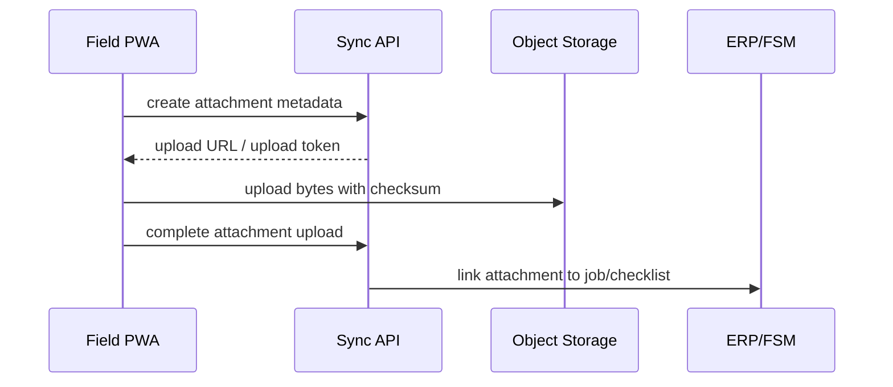

# Integration Contracts

## Purpose

This page defines the first-pass contracts between the offline field PWA, Sync API, ERP/FSM core, file storage, and planning layer. These contracts are deliberately canonical so they can survive the Odoo vs ERPNext decision.

## Contract Principle

The field app should not be tightly coupled to the selected ERP's internal tables. It should exchange canonical records and mutations with a Sync API. The ERP adapter then maps those records to Odoo/OCA, ERPNext, or another system.

## Canonical Entity Set

| Entity | Purpose | Authoritative owner |
| --- | --- | --- |
| `tenant` | Top-level deployment/customer boundary | Platform |
| `company` | Internal company, subcontractor, supplier, client | ERP/FSM |
| `user` | Human account | Identity provider / ERP |
| `project` | Commercial/project grouping | ERP/FSM or planning layer |
| `site` | Physical location | ERP/FSM |
| `job` | Work order / field task | ERP/FSM |
| `job_assignment` | Worker/crew/vehicle schedule | ERP/FSM or scheduler |
| `checklist_template` | Versioned field form | ERP/FSM or app admin |
| `checklist_response` | Completed checklist instance | Sync API -> ERP/FSM |
| `time_entry` | Labour time | Sync API -> ERP/FSM |
| `material_usage` | Material consumed/returned | Sync API -> ERP/FSM |
| `attachment` | Photo, signature, drawing, PDF | File storage + ERP link |
| `variation_request` | Field-raised commercial change | ERP/FSM |
| `dependency` | Cross-job/project blocker | Planning layer or ERP/FSM |
| `sync_mutation` | Offline write envelope | Sync API |

## Field Read API

The field PWA needs a scoped download/read API:

```http
GET /sync/bootstrap?device_id=...&since=...
GET /field/jobs?assigned_to=me&window=today-plus-14
GET /field/jobs/{job_id}
GET /field/checklist-templates?job_type=...
GET /field/documents?job_id=...
GET /field/catalog/materials?scope=vehicle-or-company
```

The response should be a compact read model, not the ERP's raw schema.

## Field Mutation API

Every field write should pass through an idempotent mutation endpoint:

```http
POST /sync/mutations
```

Example envelope:

```json
{
  "mutation_id": "device-generated-uuid",
  "device_id": "device-uuid",
  "user_id": "user-id",
  "tenant_id": "tenant-id",
  "base_version": "server-version-seen-by-client",
  "entity_type": "material_usage",
  "entity_id": "local-or-server-id",
  "operation": "append",
  "payload": {
    "job_id": "job-123",
    "sku": "CU-18WAY",
    "quantity": 1,
    "unit": "each"
  },
  "created_at": "2026-04-25T09:00:00Z"
}
```

Expected server response:

```json
{
  "mutation_id": "device-generated-uuid",
  "status": "accepted",
  "server_entity_id": "matuse-456",
  "server_version": "v17",
  "applied_at": "2026-04-25T09:03:12Z"
}
```

## Attachment Contract

Attachments should be uploaded separately from structured field mutations.



Required metadata:

- `attachment_id`
- `client_attachment_id`
- `job_id`
- `entity_type`
- `entity_id`
- `filename`
- `media_type`
- `size_bytes`
- `checksum`
- `captured_at`
- `captured_by`
- `sync_state`

## ERP Adapter Contract

The ERP adapter should expose stable methods to the Sync API:

| Method | Purpose |
| --- | --- |
| `getAssignedJobs(user, window)` | Build field job read model |
| `applyChecklistResponse(response)` | Persist completed checklist |
| `applyTimeEntry(entry)` | Create/update timesheet record |
| `applyMaterialUsage(usage)` | Create stock/material movement or consumption line |
| `applyJobStatusTransition(job, transition)` | Validate and apply job status changes |
| `createVariationRequest(request)` | Raise field-originated commercial change |
| `linkAttachment(attachment)` | Link stored file to ERP job/checklist |
| `getPermissions(user, scope)` | Resolve company/project/job access |

## Planning Adapter Contract

If OpenProject or another planning tool is used, it should receive summarized events rather than raw field mutations.

Examples:

- Job completed.
- Job blocked.
- Dependency date changed.
- Variation approved.
- Resource conflict detected.

## Conflict Contract

Conflict responses must be explicit:

```json
{
  "mutation_id": "device-generated-uuid",
  "status": "needs_review",
  "reason": "base_version_conflict",
  "server_version": "v19",
  "server_record_summary": {
    "job_status": "supervisor_review",
    "updated_by": "supervisor-1"
  }
}
```

The field app must keep the local change visible until a user or supervisor resolves it.

## Contract Gaps To Validate

| Gap | Validation route |
| --- | --- |
| Odoo/OCA field-service object names and module dependencies | Odoo POC |
| ERPNext doctypes for maintenance/job/checklist mapping | ERPNext POC |
| Attachment storage location and ERP link behavior | Odoo and ERPNext POCs |
| Material consumption semantics | Odoo and ERPNext POCs |
| Multi-company/subcontractor access checks | ERP POCs plus permission review |
| Offline conflict UI | Offline PWA spike |

