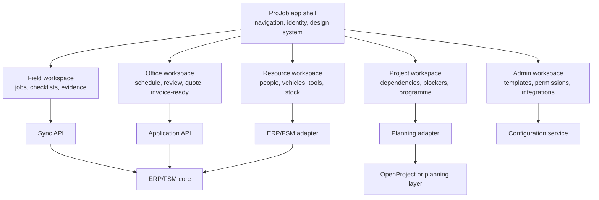

# Suite Composition and Design

## Purpose

The target product should feel like one ProJob application suite, not a set of separate open-source products stitched together with links. [Odoo/OCA](../options/odoo-oca-field-service.md), [ERPNext](../options/erpnext-frappe.md), [OpenProject](../options/openproject.md), [Atlas CMMS](../options/atlas-cmms.md), [openMAINT](../options/openmaint.md), [ODK/Kobo](../options/kobotoolbox-odk.md), or [sync libraries](../options/offline-first-pwa-stack.md) may contribute backend capabilities, patterns, or reference workflows, but users should experience a coherent product surface.

## Core Distinction

| Layer | What it means | User-facing implication |
| --- | --- | --- |
| Upstream product UI | Native screens from [Odoo](../options/odoo-oca-field-service.md), [ERPNext](../options/erpnext-frappe.md), [OpenProject](../options/openproject.md), [Atlas](../options/atlas-cmms.md), [openMAINT](../options/openmaint.md), [ODK](../options/kobotoolbox-odk.md), etc. | Useful for administrators, POCs, and reference patterns, but inconsistent if exposed directly |
| ProJob suite UI | A shared application shell, navigation model, design system, terminology, and workflow language | Preferred final experience for tradespeople, supervisors, schedulers, estimators, and clients |
| Backend capability | [ERP/FSM](component-map.md#suite-presentation-rule), [CMMS](../options/atlas-cmms.md), [planning](../options/openproject.md), [forms](../options/kobotoolbox-odk.md), [sync](integration-contracts.md#field-mutation-api), [storage](deployment-runtime.md#future-product-runtime), and reporting components | Hidden behind APIs/adapters where possible |
| Embedded specialist UI | Select upstream admin screens exposed only when cost-effective | Acceptable for internal admins, not ideal for everyday field workflows |

## Product-Suite Principle

The suite should unify business workflows even when different systems own the records.

## Recommended Suite Surfaces

| Surface | Primary users | Responsibilities |
| --- | --- | --- |
| Field workspace | Tradespeople, subcontractors | Offline jobs, checklists, photos, signatures, time, materials, notes |
| Supervisor workspace | Supervisors, contract managers | Review exceptions, approve completion, raise variations, manage blockers |
| Scheduling workspace | Schedulers, supervisors | Assign work, crews, skills, vehicles, dates, dependencies |
| Estimating workspace | Estimators, managers | Quotes, variations, line items, approvals, quote-to-job handoff |
| Resources workspace | Stores, supervisors | People, skills, vehicle stock, tools, equipment, material availability |
| Project workspace | Project managers | Cross-project dependencies, milestones, risks, programme impact |
| Client/subcontractor portal | External parties | Scoped work status, approvals, evidence, documents, comments |
| Admin workspace | Internal admins | Templates, permissions, ERP mappings, integrations, audit/export |

## Visual System Direction

The visual system should be quiet, operational, and work-focused. This is a repeated-use field and office tool, not a marketing site. The current UI technology shortlist is tracked in [UI Framework Options](ui-framework-options.md), and the practical design brief now lives in the root [`design.md`](https://github.com/ajdench/ProJob-Wiki/blob/main/design.md) file. See [DESIGN.md Standard](design-md-standard.md) for how the wiki uses that file.

| Area | Direction |
| --- | --- |
| Layout | Dense but readable work surfaces; predictable left/top navigation; compact tables and lists |
| Components | Shared buttons, filters, status chips, timeline entries, checklist rows, evidence cards, job headers |
| Status language | Consistent statuses across jobs, sync, quotes, dependencies, and approvals |
| Mobile field UI | Large tap targets, low text density, resilient forms, clear offline/sync banners |
| Office UI | Tables, boards, calendars, Gantt/dependency views, review queues, bulk actions |
| Visual styling | Neutral operational base, restrained colour use for status and priority |
| Icons | Consistent icon system for job, calendar, checklist, photo, signature, material, time, vehicle, warning |
| Accessibility | High contrast states, keyboardable office views, no colour-only status meaning |

## Shared Terminology

Use ProJob terms consistently, even if upstream systems use different words.

| ProJob term | Possible upstream equivalents |
| --- | --- |
| Job | Work order, field service order, maintenance visit, task |
| Site | Location, facility, asset location, customer premises |
| Checklist | Worksheet, form, inspection, activity, survey |
| Evidence | Attachment, photo, signature, document |
| Variation | Change order, additional work, sales order amendment |
| Blocker | Dependency, issue, impediment, delay |
| Resource | Worker, crew, vehicle, tool, asset, material |

## Integration Patterns

### Preferred Pattern: Headless Capability

Use upstream systems behind APIs/adapters. Build the user-facing workflow in ProJob.

Best for:

- [Field PWA](../options/offline-first-pwa-stack.md).
- Supervisor review.
- Cross-company portal.
- [Sync queue and conflict review](offline-sync-model.md).
- Customer-facing/client-facing views.

### Acceptable Pattern: Embedded Admin UI

Expose upstream UI only for specialist internal users where rebuilding it would be wasteful.

Possible examples:

- [ERP](component-map.md#suite-presentation-rule) accounting setup.
- Advanced stock configuration.
- [OpenProject](../options/openproject.md) programme administration.
- [CMMS](../options/atlas-cmms.md) asset hierarchy administration.

### Avoided Pattern: Patchwork Navigation

Avoid sending ordinary users between unrelated [Odoo](../options/odoo-oca-field-service.md), [OpenProject](../options/openproject.md), [CMMS](../options/atlas-cmms.md), and [form-tool](../options/kobotoolbox-odk.md) screens to complete one workflow. That produces inconsistent terminology, permissions, styling, mobile behaviour, and audit expectations.

## How Screenshots Should Be Read

Screenshots in the option pages are indicative. They show:

- Useful capability patterns.
- Workflow concepts worth testing.
- Existing product maturity and information density.
- Surfaces that may inspire ProJob design.

They do not define:

- The final ProJob visual style.
- The final navigation model.
- Whether an upstream feature works in the open-source/community edition.
- Whether a feature works offline.
- Whether a feature can be safely exposed to subcontractors or clients.

## Design-System Deliverables

Use the root [`design.md`](https://github.com/ajdench/ProJob-Wiki/blob/main/design.md) as the first design-system deliverable. Add the remaining artifacts as POC findings mature:

| Deliverable | Purpose |
| --- | --- |
| [`design.md`](https://github.com/ajdench/ProJob-Wiki/blob/main/design.md) | Practical product design brief, seed tokens, responsive layout rules, and framework recommendation |
| UI inventory | Catalogue job cards, status chips, checklists, tables, calendars, forms, review queues |
| Workflow wireframes | Field job, supervisor review, scheduler, quote variation, dependency blocker |
| Permission-aware UI rules | What each role can see/do in every surface |
| Offline state patterns | Banners, queue drawer, retry state, conflict review |
| Evidence pattern | Photos, signatures, documents, audit metadata |
| UI framework spike | Compare the recommended [UI framework options](ui-framework-options.md) against phone, tablet, and desktop workflows |

## MVP Design Scope

The first visual design target should cover:

1. Field job list and job detail.
2. Offline checklist and evidence capture.
3. Sync queue and conflict state.
4. Supervisor review queue.
5. Basic scheduling board/calendar.
6. Variation request review.

Do not attempt a full design system before the [Odoo](../poc/odoo-oca-test-plan.md) and [ERPNext](../poc/erpnext-test-plan.md) POCs reveal the real data and workflow constraints.
