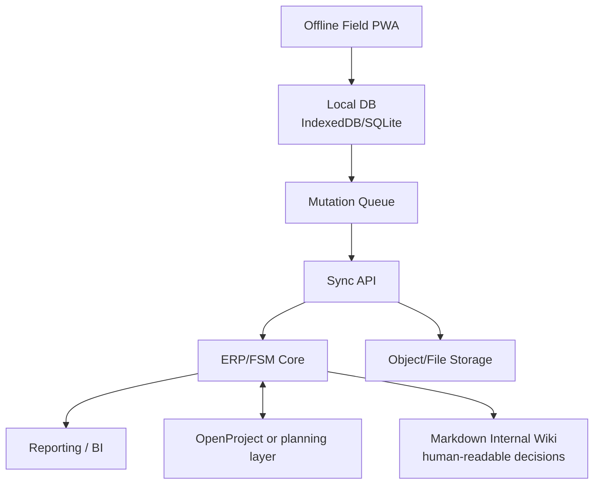

# Target Architecture

## Architecture Position

The field app should not be a thin responsive view over an ERP. It should be an offline-first work surface that syncs with a system of record.

## Components

| Component | Responsibility |
| --- | --- |
| [ERP/FSM core](component-map.md#suite-presentation-rule) | Customers, sites, quotes, jobs, stock, invoices, approvals, audit records |
| [Field PWA](../options/offline-first-pwa-stack.md) | Offline job execution, checklists, photos, signatures, time, materials, notes |
| [Sync API](integration-contracts.md#field-mutation-api) | Mutation queue ingestion, conflict detection, attachment handling, status projection |
| [Planning layer](../options/openproject.md) | Cross-project dependencies, Gantt, blocker tracking, programme reporting |
| [Document store](deployment-runtime.md#future-product-runtime) | Drawings, RAMS, photos, signed PDFs, generated quotes/invoices |
| [Internal wiki](../operations/jujutsu-workflow.md) | Requirements, workflows, architecture, ADRs, runbooks, research sources |

For a deeper responsibility split, see [Component Map](component-map.md). For the runtime view, see [Web and Stack Architecture](web-stack-architecture.md) and [Deployment Runtime](deployment-runtime.md).

For user-facing composition, the selected capabilities should be synthesised into one ProJob application suite with common visuals, terminology, navigation, and role-aware workflows. See [Suite Composition and Design](suite-composition-and-design.md).

## Logical Data Ownership

| Data | Owner |
| --- | --- |
| Customer / client | [ERP/FSM core](component-map.md#suite-presentation-rule) |
| Site / location | [ERP/FSM core](component-map.md#suite-presentation-rule) |
| Quote / proposal | [ERP/FSM core](component-map.md#suite-presentation-rule) |
| Job / work order | [ERP/FSM core](component-map.md#suite-presentation-rule) |
| Checklist template | [ERP/FSM core](component-map.md#suite-presentation-rule) or field app admin |
| Checklist response | [Field PWA](../options/offline-first-pwa-stack.md), synchronized to [ERP/FSM core](component-map.md#suite-presentation-rule) |
| Photos / signatures | [Field PWA](../options/offline-first-pwa-stack.md) capture, [document store](deployment-runtime.md#future-product-runtime) persistence |
| Time/materials | [Field PWA](../options/offline-first-pwa-stack.md) capture, [ERP/FSM core](component-map.md#suite-presentation-rule) financial posting |
| Project dependencies | [Planning layer](../options/openproject.md), projected into [ERP/FSM core](component-map.md#suite-presentation-rule) where needed |
| Audit events | [Sync API](integration-contracts.md#field-mutation-api) / [ERP/FSM core](component-map.md#suite-presentation-rule) |

## Integration Model

The important boundary is the Sync API. The field PWA should submit idempotent field mutations to the Sync API, not write directly into ERP tables. The ERP adapter then maps canonical field events into Odoo/OCA, ERPNext, or another selected core. See [Integration Contracts](integration-contracts.md).

## MVP Boundary

The MVP should include:

- Jobs assigned to worker.
- Job detail available offline.
- Checklist completion offline.
- Photo and signature capture offline.
- Time and materials capture offline.
- Sync queue with retry and visible pending state.
- Back-office review of completed work and exceptions.
- Basic quote/order/invoice linkage in ERP.

The MVP should defer:

- Route optimization.
- Advanced multi-company billing.
- Complex earned value reporting.
- AI scheduling.
- Full subcontractor marketplace behavior.
