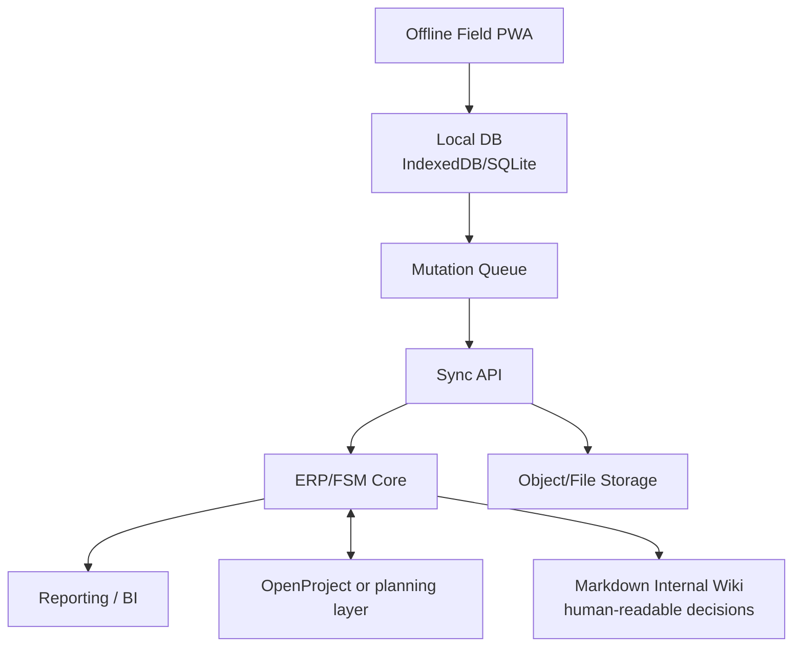

# Target Architecture

## Architecture Position

The field app should not be a thin responsive view over an ERP. It should be an offline-first work surface that syncs with a system of record.

## Components

| Component | Responsibility |
| --- | --- |
| ERP/FSM core | Customers, sites, quotes, jobs, stock, invoices, approvals, audit records |
| Field PWA | Offline job execution, checklists, photos, signatures, time, materials, notes |
| Sync API | Mutation queue ingestion, conflict detection, attachment handling, status projection |
| Planning layer | Cross-project dependencies, Gantt, blocker tracking, programme reporting |
| Document store | Drawings, RAMS, photos, signed PDFs, generated quotes/invoices |
| Internal wiki | Requirements, workflows, architecture, ADRs, runbooks, research sources |

## Logical Data Ownership

| Data | Owner |
| --- | --- |
| Customer / client | ERP |
| Site / location | ERP |
| Quote / proposal | ERP |
| Job / work order | ERP/FSM |
| Checklist template | ERP/FSM or field app admin |
| Checklist response | Field PWA, synchronized to ERP/FSM |
| Photos / signatures | Field PWA capture, document store persistence |
| Time/materials | Field PWA capture, ERP/FSM financial posting |
| Project dependencies | Planning layer, projected into ERP/FSM where needed |
| Audit events | Sync API / ERP |

## Integration Model

## MVP Boundary

The MVP should include:

- Jobs assigned to worker.
- Job detail available offline.
- Checklist completion offline.
- Photo and signature capture offline.
- Time and materials capture offline.
- Sync queue with retry and visible pending state.
- Back-office review of completed work and exceptions.
- Basic quote/order/invoice linkage in ERP.

The MVP should defer:

- Route optimization.
- Advanced multi-company billing.
- Complex earned value reporting.
- AI scheduling.
- Full subcontractor marketplace behavior.

