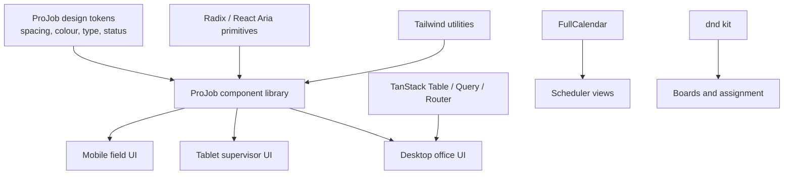

# UI Framework Options

Date: 2026-04-25

## Purpose

This page records open-source web UI framework and component-library options for building the ProJob suite across mobile, tablet, and desktop. It should be read alongside [Suite Composition and Design](suite-composition-and-design.md), [Web and Stack Architecture](web-stack-architecture.md), the [offline-first PWA stack](../options/offline-first-pwa-stack.md), and the root [`design.md`](https://github.com/ajdench/ProJob-Wiki/blob/main/design.md) design brief.

The goal is not to find a theme that looks nice. The goal is to choose a UI foundation that can express functional ProJob components consistently:

- Field job list and job detail.
- Offline checklists, forms, photos, signatures, and sync state.
- Supervisor review queues.
- Scheduler boards, calendars, crews, skills, and vehicles.
- Estimating and variation review.
- Resource, stock, equipment, and document views.
- Cross-project blockers and dependency views.
- Admin-only configuration screens.

## Recommendation

The strongest default direction is:

| Layer | Recommended research direction | Why |
| --- | --- | --- |
| App framework | React + TypeScript, likely Vite or a light router-first app | Good PWA fit, broad library support, avoids forcing the field app through a server-rendered mental model |
| Styling/design tokens | Tailwind CSS plus ProJob-owned tokens from root [`design.md`](https://github.com/ajdench/ProJob-Wiki/blob/main/design.md) | Flexible enough for a custom operational design system |
| Base components | shadcn/ui over Radix UI primitives | Gives component source ownership, accessible primitives, and strong Tailwind alignment |
| Accessibility fallback | React Aria Components | Useful when a complex control needs stronger accessibility semantics than a styled component kit gives |
| Data tables | TanStack Table | Headless tables for dense desktop office workflows |
| Server/cache state | TanStack Query | Fits sync-aware API data and background refresh patterns |
| Routing | TanStack Router or React Router | Type-safe or mature route/data handling for a multi-workspace suite |
| Forms | React Hook Form + Zod | Good fit for checklists, validation, and API contract alignment |
| Scheduling/calendar | FullCalendar, tested carefully | Useful for scheduling views; verify license boundaries and mobile UX |
| Drag and drop | dnd kit | Useful for boards, assignment, ordering, and scheduler interactions |
| Icons | Lucide | Consistent open-source icon set already aligned with many shadcn examples |

This is not a final stack decision. It is the most practical first research path for the [offline PWA spike](../poc/offline-pwa-test-plan.md) and first ProJob UI prototype.

## Why This Direction Fits ProJob

ProJob needs product-specific screens, not generic admin screens. A copy-owned component approach is more suitable than a rigid enterprise theme because the field workflow needs custom offline banners, queue drawers, evidence capture, job status language, and role-aware simplification.

The useful pattern is:

The ProJob component library should wrap third-party primitives rather than exposing library-specific components directly throughout the app. That keeps the visual system, terminology, permissions, and offline state language under ProJob control.

## Candidate Families

### React + Tailwind + shadcn/ui

Best fit for a custom ProJob suite where the team wants to own the UI code.

| Strength | Risk |
| --- | --- |
| Strong ownership of component code; good fit for custom operational surfaces | Requires discipline to avoid inconsistent one-off component edits |
| Works naturally with Tailwind and design tokens | shadcn/ui is a component source pattern, not a full product design system |
| Can combine Radix primitives, TanStack data tools, dnd kit, and FullCalendar | The team must define ProJob-specific layout, state, and workflow components |

Use this first for the field PWA and supervisor/scheduler prototype.

### React + MUI, Mantine, Chakra, or PrimeReact

Best fit where speed and complete ready-made components matter more than full visual ownership.

| Family | Fit | Concern |
| --- | --- | --- |
| MUI | Very mature React component ecosystem and theming | Can quickly feel like generic Material Design unless heavily adapted |
| Mantine | Broad React component and hooks library | Good app velocity, but less source ownership than shadcn-style components |
| Chakra UI | Accessible React component system with design-system focus | Good for general app UI; verify complex data/scheduler needs |
| PrimeReact | Large enterprise component set | Strong for component coverage, but the final suite may feel less bespoke |

These should remain benchmark alternatives, especially for admin-heavy screens.

### Ionic

Best fit if the field app needs a native-mobile feel from a web codebase.

| Strength | Risk |
| --- | --- |
| Strong mobile/PWA/app-shell orientation | Less natural for dense desktop office workflows |
| Web Components core with React support | May push the UI toward mobile-native conventions that do not suit office surfaces |
| Useful for phone-first field workflows | Could require a separate desktop component language |

Use Ionic as a comparison if the field PWA prototype struggles with mobile affordances, installability, or touch ergonomics.

### Vue + Quasar

Best fit if the team wants one integrated framework for SPA, PWA, mobile, and desktop packaging.

| Strength | Risk |
| --- | --- |
| Strong cross-platform story from a single Vue codebase | Commits the app to Vue rather than the broader React ecosystem |
| Mature component set and PWA/mobile/desktop modes | Styling may need significant adaptation to avoid a generic framework feel |
| Could be fast for a small team | Less alignment with React-heavy libraries like TanStack Table examples and shadcn/ui |

Quasar is the strongest non-React alternative to evaluate.

### Svelte/SvelteKit + Skeleton

Best fit if developer simplicity and compiled components become a priority.

| Strength | Risk |
| --- | --- |
| Productive component model and Tailwind-friendly UI options | Smaller enterprise component ecosystem than React |
| Skeleton provides an open-source design-system/component direction | Some specialist widgets may need more custom work |
| Good fit for custom UI if the team prefers Svelte | Less default compatibility with React-oriented component examples |

Keep as a secondary option, not the first POC route.

### Web Components: Shoelace / Web Awesome

Best fit where framework independence is a hard requirement.

| Strength | Risk |
| --- | --- |
| Framework-agnostic components | Extra wrapper work inside a React/Vue/Svelte app |
| Useful for long-lived design-system primitives | May not cover all dense operational app needs |
| Can be shared across multiple frontend frameworks | Less tailored than a ProJob-owned component library |

Use as a reference or compatibility layer, not the first app foundation.

## Functional Component Mapping

| ProJob need | Candidate UI/tool family | Notes |
| --- | --- | --- |
| App shell, sidebar, tabs, dialogs, drawers | shadcn/ui + Radix, or MUI/Mantine/Chakra | Must become ProJob-owned shell components |
| Mobile field job cards | Tailwind + ProJob components | Avoid generic card-heavy UI; field cards need scan-friendly status and offline cues |
| Offline/sync banners and queue drawer | Custom ProJob components | Should be app-specific, not a library default |
| Checklists and dynamic forms | React Hook Form, Zod, shadcn form controls | Must support save-as-you-go, validation, and conflict state |
| Photos, signatures, documents | Custom capture/evidence components | Must integrate with the [attachment contract](integration-contracts.md#attachment-contract) |
| Desktop tables | TanStack Table, MUI Data Grid, PrimeReact DataTable | TanStack gives most visual control; MUI/PrimeReact give more ready-made behavior |
| Scheduling calendar | FullCalendar or custom board/calendar | Test mobile touch, resource assignment, and licensing boundaries |
| Kanban/review boards | dnd kit + ProJob cards | Needs keyboard and touch testing |
| Dependency graph or workflow map | React Flow or custom visualization later | Not needed for first field PWA spike |
| Charts and dashboards | Recharts, Tremor-style patterns, or MUI/Prime charts later | Defer until real reporting needs exist |
| Icons | Lucide | Keep icon vocabulary small and role-specific |

## Evaluation Criteria

Score UI framework options against:

| Criterion | Why it matters |
| --- | --- |
| Offline/PWA compatibility | Field work must load, navigate, and show local state without network |
| Mobile ergonomics | Phone field use is primary; large tap targets and resilient forms matter |
| Tablet fit | Supervisors need review, photos, comments, and scheduling in mixed contexts |
| Desktop density | Office users need tables, filters, queues, boards, and calendars |
| Accessibility | Keyboard, screen reader, focus, and colour-state behavior must be credible |
| Design ownership | ProJob needs one suite identity, not an upstream product skin |
| Component coverage | Scheduler, tables, forms, drawers, modals, status chips, uploads, and evidence previews |
| Data integration | Components must work with local DB state, sync queues, and API cache state |
| Theming and tokens | Status, priority, sync, role, and company scoping need consistent visual language |
| Long-term maintainability | Avoid framework lock-in where possible; wrap third-party controls |

## Proposed UI POC

Build a small UI spike before any full app shell:

1. Field job list and job detail on a phone viewport.
2. Checklist with partial completion, required fields, photos, and signature placeholder.
3. Offline banner, sync queue drawer, pending/synced/failed state.
4. Supervisor review queue on tablet.
5. Desktop scheduling/review view with table and board/calendar variant.
6. Shared status chips, buttons, filters, page headers, and job timeline across all three viewports.

Compare at least two stacks:

| Stack | Reason to test |
| --- | --- |
| React + Tailwind + shadcn/ui/Radix + TanStack | Recommended default and best source-ownership path |
| Quasar or Ionic | Cross-platform/mobile-first benchmark |
| MUI or Mantine | Ready-made enterprise React benchmark |

## Current Decision

Use **React + TypeScript + Tailwind + shadcn/ui/Radix + TanStack tools** as the first UI research direction.

Keep **Quasar**, **Ionic**, **MUI**, **Mantine**, **Chakra**, **PrimeReact**, **Skeleton**, and **Shoelace/Web Components** as comparison families.

The final decision should be made only after a real responsive UI spike proves that the same component language can support field mobile, supervisor tablet, and office desktop workflows.

## Sources

- [shadcn/ui documentation](https://ui.shadcn.com/docs)
- [Radix Primitives documentation](https://www.radix-ui.com/primitives/docs/overview/introduction)
- [React Aria Components documentation](https://react-spectrum.adobe.com/react-aria/components.html)
- [Ionic Framework documentation](https://ionicframework.com/docs)
- [MUI documentation](https://mui.com/material-ui/getting-started/)
- [Mantine documentation](https://mantine.dev/)
- [Chakra UI documentation](https://chakra-ui.com/docs/components/concepts/overview)
- [PrimeReact documentation](https://primereact.org/)
- [Quasar Framework PWA documentation](https://quasar.dev/quasar-cli-webpack/developing-pwa/introduction)
- [Skeleton documentation](https://www.skeleton.dev/)
- [Shoelace documentation](https://shoelace.style/)
- [TanStack Table repository](https://github.com/TanStack/table)
- [TanStack Query documentation](https://tanstack.com/query/docs/docs)
- [TanStack Router documentation](https://tanstack.com/router/router/docs)
- [FullCalendar documentation](https://fullcalendar.io/docs)
- [dnd kit documentation](https://docs.dndkit.com/)
- [React Hook Form documentation](https://react-hook-form.com/)
- [Zod documentation](https://odocs-zod.vercel.app/)
- [Lucide documentation](https://lucide.dev/)
