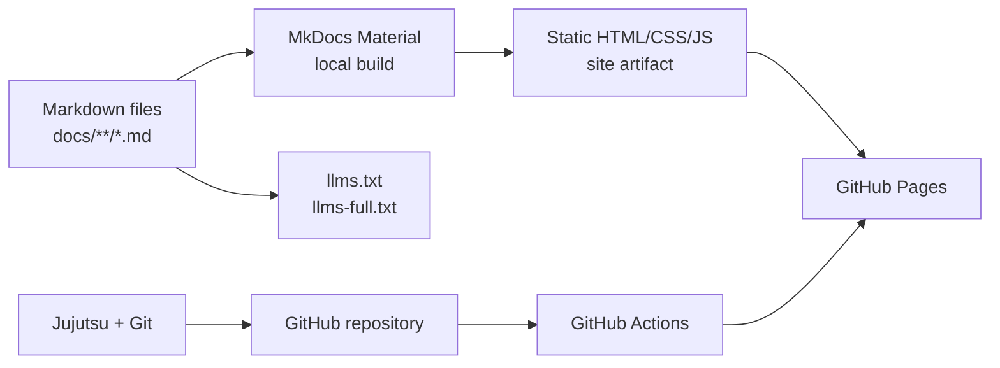
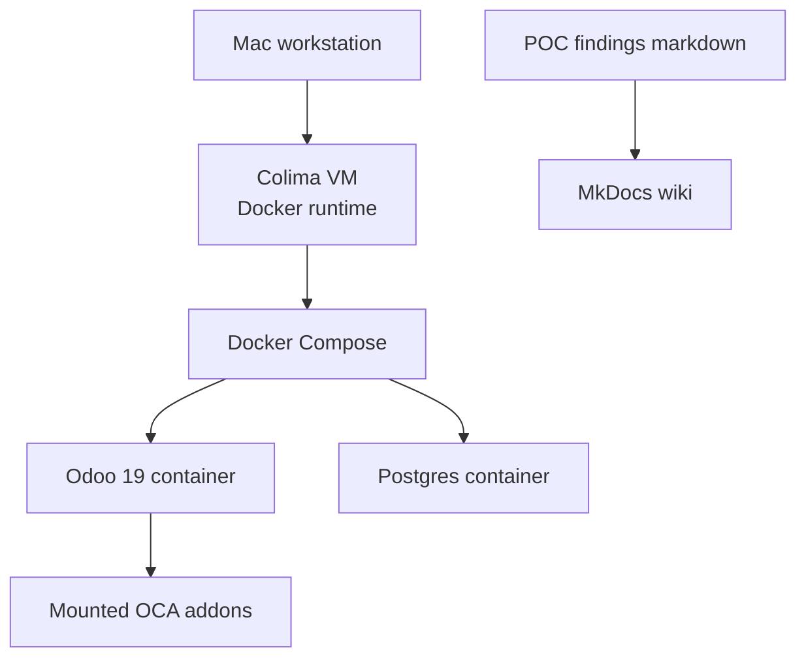
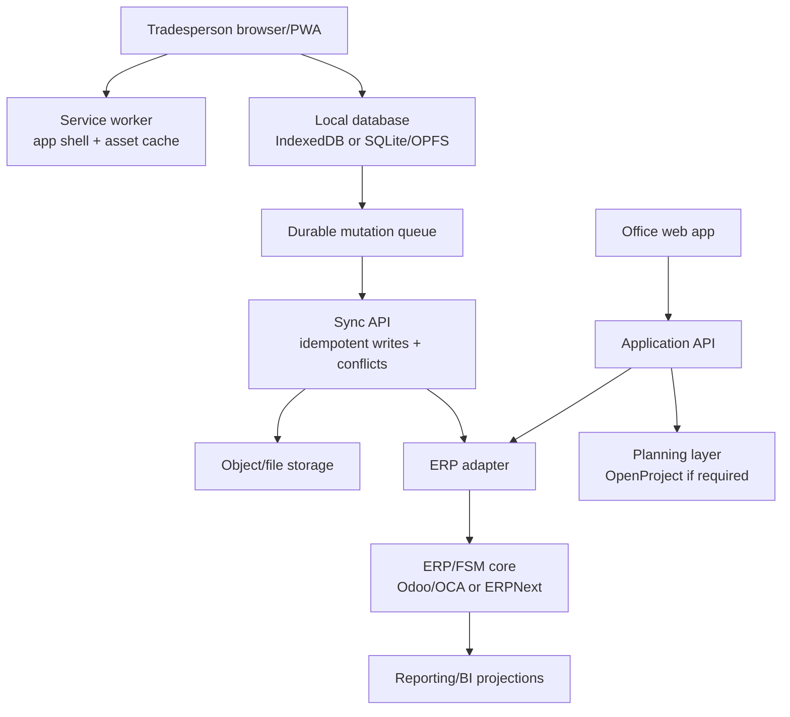

# Web and Stack Architecture

## Purpose

This page explains how the proposed components work together as a web application stack. It separates three things that can otherwise get confused:

- The current documentation/wiki stack.
- The proof-of-concept infrastructure stack.
- The future product stack.

## Current Documentation Stack

| Layer | Current choice | Responsibility |
| --- | --- | --- |
| Source | Markdown | Durable human-readable knowledge base |
| Local version control | Jujutsu with colocated Git | Fluid local changes and Git publishing |
| Site generator | MkDocs Material | Searchable static wiki |
| Hosting | GitHub Pages | Public static site |
| Automation | GitHub Actions | Strict build and deploy |
| LLM discovery | `llms.txt`, `llms-full.txt` | Machine-readable entry points |

## POC Infrastructure Stack

The POC stack is intentionally local and disposable. It exists to validate product fit, not to become production infrastructure.

| Layer | Current choice | Notes |
| --- | --- | --- |
| Container runtime | Docker via Colima | Verified with `hello-world` |
| Compose | Docker Compose | Used by `experiments/odoo-oca/compose.yml` |
| ERP POC | Odoo 19 image | Official Docker image requires PostgreSQL |
| Addons | OCA `19.0` branches | Mounted under `/mnt/extra-addons` |
| Database | PostgreSQL 16 | Local named volume in compose |
| Podman | Installed but not active | `podman machine start` currently fails/hangs at `vfkit`; not blocking |

## Future Product Stack

The product should be a web-first, offline-capable application with the field PWA as a dedicated surface.

## Browser/PWA Layer

The field PWA should:

- Load the app shell offline after first use.
- Store assigned jobs, checklist templates, job documents, and queued writes locally.
- Treat the local database as the UI read model.
- Show sync state clearly.
- Continue working through tab reloads, app restarts, and poor signal.

The service worker handles installability and static assets. It does not solve data sync by itself.

## Local Data Layer

Candidate local data approaches:

| Approach | Web storage model | Best fit |
| --- | --- | --- |
| PouchDB + CouchDB | IndexedDB plus CouchDB replication | Maximum open-source replication maturity |
| RxDB | IndexedDB or other storage adapters with replication plugins | Reactive UI and custom sync flexibility |
| Dexie.js + custom sync | IndexedDB wrapper plus custom queue | Smallest abstraction, highest sync responsibility |
| PowerSync | Client-side SQLite, including web support | SQL-style local-first app backed by server database |

## Backend Layer

The backend should be split into:

- **Application API** for office/admin screens.
- **Sync API** for offline field mutations.
- **ERP adapter** for translating canonical jobs, materials, time, and commercial events into the chosen ERP.
- **Attachment service** for photos, signatures, PDFs, and drawings.
- **Reporting projections** for dashboards and project controls.

## ERP/FSM Layer

The ERP/FSM core owns commercial and operational records that need auditability:

- Customers, contacts, and sites.
- Quotes, orders, variations, invoices.
- Jobs/work orders.
- Stock and materials.
- Timesheets and cost capture.
- Approvals and audit trail.

The field app should not write directly into ERP tables while offline. It should submit mutations to the Sync API, which validates and applies them through the ERP adapter.

## Planning Layer

OpenProject or another planning tool should only be introduced if the business needs programme-level dependency control. It should not own job completion, material usage, or invoice state.

Planning layer responsibilities:

- Cross-project dependencies.
- Milestones and baseline dates.
- Programme blockers.
- Work package rollups.

## Recommended Stack Direction

For the next proof-of-concept phase:

1. Use **Docker/Colima** for local ERP experiments.
2. Continue testing **Odoo/OCA** first as the ERP/FSM candidate.
3. Keep the offline PWA stack open until the Odoo and ERPNext API boundaries are understood.
4. For the offline PWA spike, test **PouchDB/CouchDB** and **RxDB custom sync** first.
5. Treat **PowerSync** as a serious later option if the team chooses a Postgres-centric custom backend instead of relying primarily on ERP APIs.

