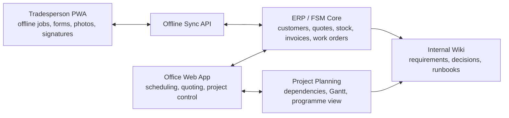

# Offline-First Trades Operations Platform Research

Date: 2026-04-24

## Purpose

This research pack evaluates open-source options for a multi-functional, offline-first PWA solution for tradespeople and work-site projects. The target platform needs to support individual trades, internal teams, subcontractors, and cross-company dependencies.

The scope includes:

- Checklists, inspections, forms, risk assessments, photos, signatures, and field notes.
- Job lists, work orders, site visits, recurring work, snagging, and remedials.
- Resource management: people, skills, vehicles, tools, equipment, materials, and stock.
- Scheduling, dispatch, project dependencies, and cross-project visibility.
- Quoting, variations, proposals, purchase requests, purchase orders, invoices, and cost tracking.
- External collaboration with clients, contractors, suppliers, and partners.
- Offline-first mobile/PWA usage for low-connectivity sites.

## Key Finding

No single open-source product appears to satisfy the full requirement set cleanly. The strongest direction is a composed architecture:

1. A back-office ERP or field-service core as the system of record.
2. A dedicated offline-first PWA for tradespeople and site work.
3. A project planning layer where cross-project dependencies and Gantt planning matter.
4. A Markdown research and architecture wiki to keep decisions human-readable and versionable.

## Recommended First Shortlist

| Role | First candidates |
| --- | --- |
| ERP / system of record | Odoo Community + OCA Field Service, ERPNext / Frappe, Dolibarr |
| Field work / CMMS | Atlas CMMS, openMAINT |
| Project planning | OpenProject |
| Offline field app foundation | RxDB, PouchDB/CouchDB, Dexie.js, ElectricSQL, PowerSync |
| Offline forms/checklists | KoboToolbox / ODK |

## Recommended Product Shape

The pragmatic target architecture is:

## Immediate Next Step

Run a two-week proof-of-concept against three options:

- Odoo Community + OCA Field Service.
- ERPNext / Frappe.
- Custom offline-first PWA using RxDB or PouchDB/CouchDB, integrated to a simple API.

Use the same test scenario for each: quote, schedule, dispatch, complete job offline, use materials, capture evidence, sync, raise variation, invoice, and report cross-project impact.

## Current Documentation Gaps

The gap register is now tracked as a first-class page: [Gap Register](evaluation/gap-register.md). The main remaining gaps require proof-of-concept evidence rather than more desk research:

- Whether Odoo/OCA or ERPNext is the better ERP/FSM system of record.
- Which offline PWA sync stack is safest for field writes and attachments.
- The exact API contract between field app, sync service, ERP adapter, and file storage.
- The real multi-company permission model after user/workflow examples are tested.
