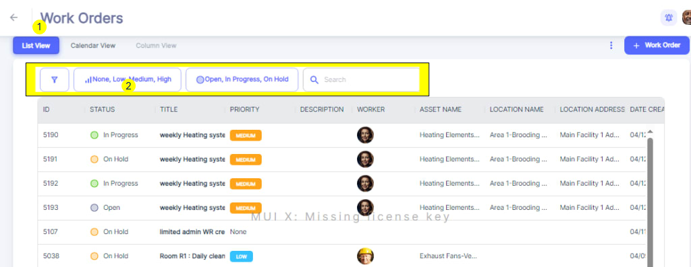
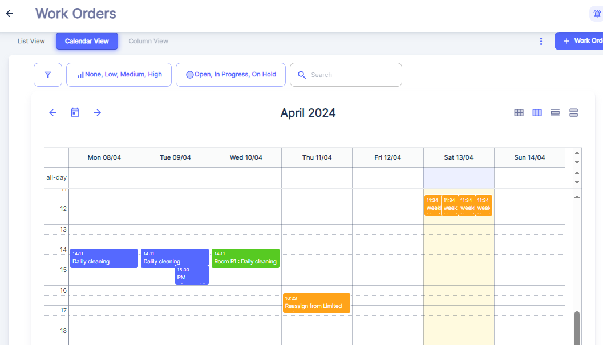

# Atlas CMMS

## Summary

Atlas CMMS is an open-source/self-hostable CMMS candidate focused on work orders, preventive maintenance, asset management, parts inventory, dashboards, mobile use, and scheduling.

Sources:

- [Atlas CMMS official site](https://atlas-cmms.com/)
- [Atlas CMMS GitHub repository](https://github.com/Grashjs/cmms)
- [Atlas CMMS docs](https://docs.atlas-cmms.com/)

## Indicative Screenshots

These screenshots show Atlas CMMS work-order list and calendar surfaces, which are relevant as a technician/work-order UX benchmark. They replace the earlier app-store style visual because that did not show useful product functionality.

Source: [Atlas CMMS work-order documentation](https://docs.atlas-cmms.com/workflows-management/work-order/managing-manual-work-orders/viewing-work-orders/)

Source: [Atlas CMMS work-order documentation](https://docs.atlas-cmms.com/workflows-management/work-order/managing-manual-work-orders/viewing-work-orders/)

## Suite Integration Distinction

Atlas CMMS is being evaluated as a work-order, mobile, asset, and inventory UX benchmark. Its screens are useful references for technician workflows, but the final ProJob field experience should remain one consistent offline-first PWA.

## Functional Fit

| Area | Fit |
| --- | --- |
| Work orders | Strong |
| Preventive maintenance | Strong |
| Checklists | Medium to strong |
| Assets/equipment | Strong |
| Parts inventory | Strong |
| Mobile field use | Medium to strong |
| Offline mobile | Promising; verify edition/license behavior |
| Quoting/sales/invoicing | Weak |
| Cross-project management | Weak |

## Strengths

- Closer to technician work execution than generic ERP/project tools.
- Strong asset/work-order/PM/inventory orientation.
- Self-hosted option and mobile focus.
- Good candidate for learning field UX patterns.

## Gaps / Risks

- It is CMMS-oriented, not a complete trades ERP.
- License and commercial feature boundaries need careful verification.
- Quote-to-cash and project dependency workflows likely require integration or separate tooling.

## Best Role

Use as a field-work/maintenance benchmark, especially for asset-heavy trades, facilities, and planned maintenance.

## Proof-of-Concept Test

1. Self-host with Docker.
2. Create assets, locations, work requests, work orders, checklists, and parts.
3. Test mobile offline mode with real device behavior.
4. Validate API/integration options for ERP and project systems.
