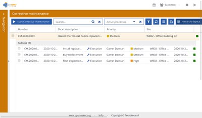
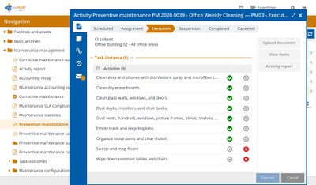

# openMAINT

## Summary

openMAINT is an AGPL-licensed open-source solution for property, facility, asset, maintenance, logistics, and economic management. It is more facility/asset-management oriented than general trades project execution, but it covers several relevant workflows.

Source:

- [openMAINT brochure](https://www.openmaint.org/en/resources/brochure)
- [openMAINT screenshots](https://www.openmaint.org/en/resources/screenshots)

## Indicative Screenshots

These screenshots show openMAINT's maintenance-oriented asset/facility workflows. They are most relevant where the trades platform becomes asset-heavy or facilities-maintenance-heavy.

Source: [openMAINT screenshots](https://www.openmaint.org/en/resources/screenshots)

Source: [openMAINT screenshots](https://www.openmaint.org/en/resources/screenshots)

## Suite Integration Distinction

openMAINT is being evaluated as an asset/facility-maintenance benchmark. If any openMAINT-style capability is adopted, it should appear in ProJob as asset/resource/maintenance views with consistent styling, rather than as a separate everyday UI for trades users.

## Functional Fit

| Area | Fit |
| --- | --- |
| Assets/facilities | Strong |
| Preventive/scheduled maintenance | Strong |
| Work orders | Strong |
| Spare parts/logistics | Medium to strong |
| Purchase requests/orders | Medium |
| Contracts | Medium |
| Custom workflows | Medium to strong |
| Field PWA/offline | Unclear; verify |
| Quoting/sales | Weak |

## Strengths

- Strong fit for facilities, buildings, equipment, and maintenance manuals.
- Generates scheduled maintenance calendars and work orders.
- Includes asset movement lifecycle and spare/consumer product support.
- Includes economic workflows such as suppliers, budgets, purchase requests/orders/invoices.

## Gaps / Risks

- Heavier and more enterprise/facility oriented.
- Likely less suitable for small trades teams unless asset management dominates.
- Offline-first field UX requires investigation.

## Best Role

Use as an asset/facility maintenance benchmark, not as the primary first choice for trades quote-to-cash.

## Proof-of-Concept Test

1. Model one building/site, assets, maintenance manual, scheduled PM, and breakdown request.
2. Create work order and spare part movement.
3. Test workflow customization for approval and subcontractor involvement.
