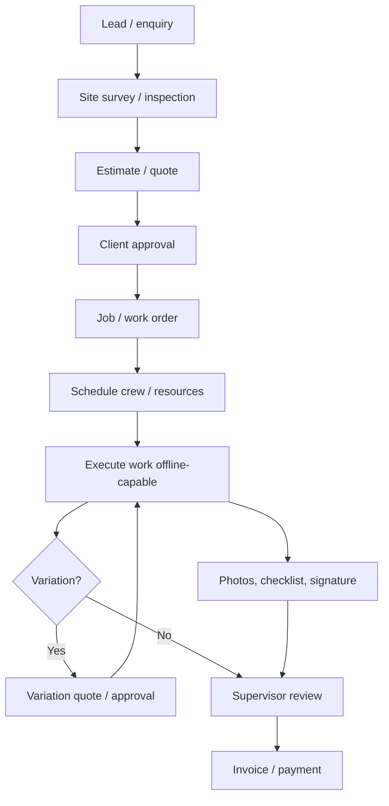
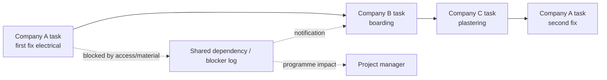

# Workflow Map

## Quote to Cash

## Site Work Execution

1. Scheduler assigns job, planned materials, required checklist, documents, and expected duration.
2. Worker downloads assigned jobs and documents before travel, or they are pre-synced automatically.
3. Worker arrives on site, starts job, completes pre-work risk checklist, and captures notes/photos.
4. Worker records labour, materials used, issues found, and external blockers.
5. Worker completes checklist and captures customer/client signature where required.
6. PWA queues all changes locally if offline.
7. Sync service uploads changes, attachments, and local events when connectivity returns.
8. Supervisor reviews exceptions, failed checklist items, variations, and incomplete evidence.

## Cross-Company Dependency Flow

## Resource Management Flow

| Resource | Planning question | Field question |
| --- | --- | --- |
| Person | Who is available and qualified? | Who actually attended and for how long? |
| Crew | Which team can complete this package? | Did the crew complete all required checks? |
| Vehicle | Which van has the right stock/tools? | What was consumed from the vehicle? |
| Tool/equipment | Is it booked, certified, calibrated? | Was it used, damaged, returned? |
| Material | Is it available before job date? | What was installed, wasted, or returned? |

